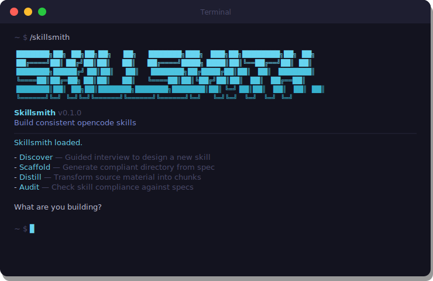

<div align="center">
  
</div>

<div align="center">

# Skillsmith

**Build consistent opencode skills using standardized syntax and guided workflows.**

[](https://opencode.ai/code)
[](LICENSE)

</div>

---

## Contents

- [What Skillsmith Does](#what-skillsmith-does)
- [Commands](#commands)
- [The Problem](#the-problem)
- [How It Works](#how-it-works)
- [Architecture](#architecture)
- [Syntax Specs](#syntax-specs)
- [Ecosystem](#ecosystem)
- [Install](#install)

---

## What Skillsmith Does

opencode skills are markdown files that give opencode a persona, routing logic, and domain knowledge. They're powerful — but there's no standard for how to write them. Every skill looks different. Entry points mix routing with process logic. Tasks miss required sections. Templates use inconsistent placeholders. When you share a skill, someone else has to reverse-engineer your conventions.

Skillsmith fixes this. It's a meta-skill — a skill that builds other skills — with four workflows:

1. **Discover** — Guided interview that captures every design decision and produces a structured skill spec
2. **Scaffold** — Takes a skill spec and generates a compliant directory with all files following syntax standards
3. **Distill** — Transforms raw source material (books, courses, transcripts) into structured framework chunks ready for skill consumption
4. **Audit** — Checks existing skills against the syntax specs and produces a compliance report with remediation priorities

The result: skills that are consistent, portable, and immediately understandable by anyone who reads them.

---

## Commands

| Command | What It Does |
|---------|-------------|
| `/skillsmith` | Show available workflows |
| `/skillsmith discover` | Guided interview to design a new skill — produces a skill spec |
| `/skillsmith scaffold` | Generate a compliant skill directory from a spec |
| `/skillsmith distill` | Transform raw source material into framework chunks |
| `/skillsmith audit` | Audit skill compliance against syntax specs |

---

## The Problem

opencode's slash command system is a superpower. Drop markdown files in `.opencode/commands/` and opencode gets new capabilities — personas, workflows, domain knowledge, quality gates. But there's no enforced structure. Skills built without conventions end up with:

- **Entry points doing too much.** Routing mixed with process logic. Bloated files that opencode loads entirely even when you only need one command.
- **Inconsistent file types.** Tasks that look like frameworks. Templates without placeholder conventions. Context files that never get updated.
- **Missing sections.** No acceptance criteria. No user stories. No "Not For" boundaries. opencode interprets vaguely and produces inconsistent results.
- **No portability.** Your skill works in your workspace because you know the conventions. Someone else installs it and gets confused immediately.

Skillsmith defines seven file types — entry points, tasks, templates, frameworks, context, checklists, and rules — each with a syntax spec. The specs define what sections are required, what format they use, and what anti-patterns to avoid. Then it gives you workflows to build skills that follow those specs from the start.

---

## How It Works

### Discovery Flow

```
/skillsmith discover
      │
      ▼
  Identity ──▶ Persona ──▶ Scope ──▶ Content ──▶ Review
  (name,type)  (role,style) (commands)  Architecture  (confirm)
      │                                    │
      ▼                                    ▼
  "revops-expert"               tasks: 3, frameworks: 5,
  standalone, operations        templates: 2, context: 1
                                           │
                                           ▼
                                    SKILL-SPEC.md
```

Discovery asks one question group at a time, validates as it goes, and produces a structured spec. No guessing at conventions — the interview covers every decision.

### Scaffold Flow

```
/skillsmith scaffold
      │
      ▼
  Read spec ──▶ Choose ──▶ Create ──▶ Generate ──▶ Validate
  (parse all    location    dirs       all files    against
   sections)    (apps/,              (entry point,  rules
                local,                tasks,
                custom)               frameworks...)
                                          │
                                          ▼
                                  Complete skill directory
                                  ready to customize
```

Scaffold reads a skill spec and generates every file with meaningful scaffolded content — not empty shells. Entry points get proper YAML frontmatter and all five XML sections. Tasks get purpose, user story, steps with wait points, and acceptance criteria. For skills with 10+ files, it offers a PAUL-managed phased build.

### Distill Flow

```
/skillsmith distill
      │
      ▼
  Assess source ──▶ Chunking plan ──▶ Extract chunks ──▶ Validate
  (read material,    (concept-based,   (core concept,     (framework
   estimate scope)    not chapters)      frameworks,        rules
                                         templates,         compliance)
                                         decision tools)
```

Distill takes raw knowledge — a book, a course transcript, collected notes — and turns it into structured framework chunks. Each chunk stands alone, has a core concept synthesis (not a summary), frameworks with "When to use" triggers, fill-in templates, and IF/THEN decision tools.

### Audit Flow

```
/skillsmith audit [path]
      │
      ▼
  Inventory ──▶ Entry point ──▶ Each folder ──▶ Report
  structure      assessment       vs its spec    (compliance %,
  (classify      (frontmatter,    (tasks.md,     violations,
   components)    5 XML sections,  frameworks.md, remediation
                  conventions)     templates.md)  priorities)
```

Audit reads an existing skill, checks every file against its corresponding syntax spec, and produces a scored compliance report. Supports single skill or batch mode across an entire commands directory.

---

## Architecture

```
skillsmith/
├── skillsmith/                     The skill itself
│   ├── skillsmith.md               Entry point (Skillsmith-compliant, naturally)
│   ├── tasks/
│   │   ├── discover.md             5-phase guided interview
│   │   ├── scaffold.md             Spec-to-directory generator
│   │   ├── distill.md              Source material chunker
│   │   └── audit.md                Compliance checker
│   ├── rules/                      Authoring rules per file type
│   │   ├── entry-point-rules.md    Entry point validation rules
│   │   ├── tasks-rules.md          Task file validation rules
│   │   ├── frameworks-rules.md     Framework file validation rules
│   │   ├── templates-rules.md      Template file validation rules
│   │   ├── context-rules.md        Context file validation rules
│   │   └── checklists-rules.md     Checklist file validation rules
│   └── templates/
│       └── skill-spec.md           Output format for discovery
├── specs/                          Syntax specifications (reference docs)
│   ├── entry-point.md              How to write entry points
│   ├── tasks.md                    How to write task files
│   ├── frameworks.md               How to write framework files
│   ├── templates.md                How to write template files
│   ├── context.md                  How to write context files
│   ├── checklists.md               How to write checklist files
│   └── rules.md                    How to write rules (meta-skill only)
├── bin/
│   └── install.js                  npm installer
├── package.json
└── README.md
```

**Two layers by design:**
- **`skillsmith/`** — The operational skill. Tasks, rules, templates. This is what opencode loads and executes.
- **`specs/`** — Reference documentation. The syntax specifications that define how each file type should be written. Tasks and audits reference these on-demand — they're never loaded upfront.

Rules vs Specs: Rules are compact enforcement checklists ("must have X, anti-pattern Y"). Specs are the full documentation ("here's what X means, here's why, here are examples"). The audit task loads rules for fast checking. The scaffold task loads specs for correct generation.

---

## Syntax Specs

Skillsmith defines seven file types. Each has a syntax specification that defines structure, conventions, and anti-patterns.

| File Type | Purpose | Mutable? | Frontmatter? |
|-----------|---------|----------|--------------|
| **Entry Point** | Identity + routing | No | Yes (YAML) |
| **Task** | Guided workflow | No | No |
| **Framework** | Domain knowledge | No | No |
| **Template** | Structured output | No | Yes (YAML) |
| **Context** | User/business state | Yes | No |
| **Checklist** | Quality gate | No | No |
| **Rules** | Validation rules | No | Yes (YAML) |

### Placeholder Conventions

Every skill built with Skillsmith uses consistent placeholders:

| Syntax | Meaning | Example |
|--------|---------|---------|
| `{curly-braces}` | Variable interpolation — replaced with exact input | `{skill-name}` becomes `revops-expert` |
| `[square-brackets]` | Human-written prose — replaced with descriptive text | `[role definition]` becomes `Senior revenue operations strategist` |

### Skill Tiers

| Tier | Structure | When to Use |
|------|-----------|-------------|
| `suite` | Orchestrator with sub-commands | Multi-workflow tools (Skillsmith itself) |
| `standalone` | Single skill with auxiliary folders | Most skills |
| `task-only` | Entry point only, no auxiliary folders | Lightweight single-purpose |

---

## Ecosystem

Skillsmith is part of a broader opencode extension ecosystem:

| System | What It Does | Link |
|--------|-------------|------|
| **AEGIS** | Multi-agent codebase auditing — diagnosis + controlled evolution | [GitHub](https://github.com/ChristopherKahler/aegis) |
| **BASE** | Builder's Automated State Engine — workspace lifecycle, health tracking, drift prevention | [GitHub](https://github.com/ChristopherKahler/base) |
| **CARL** | Context Augmentation & Reinforcement Layer — dynamic rules loaded JIT by intent | [GitHub](https://github.com/ChristopherKahler/carl) |
| **PAUL** | Project orchestration — Plan, Apply, Unify Loop | [GitHub](https://github.com/ChristopherKahler/paul) |
| **SEED** | Typed project incubator — guided ideation through graduation | [GitHub](https://github.com/ChristopherKahler/seed) |
| **Skillsmith** | Skill builder — standardized syntax specs + guided workflows | You are here |
| **CC Strategic AI** | Skool community — courses, community, live support | [Skool](https://skool.com/cc-strategic-ai) |

All tools are standalone. SEED was built with Skillsmith. Scaffold can optionally hand off to PAUL for phased builds. No dependencies required.

---

## Install

```bash
npx @chrisai/skillsmith
```

One command. Installs the skill to `~/.opencode/commands/skillsmith/` — available in every workspace.

```bash
# Global install (default) — available everywhere
npx @chrisai/skillsmith

# Install to current project only
npx @chrisai/skillsmith --local

# Custom opencode config directory
npx @chrisai/skillsmith --config-dir /path/to/.opencode
```

Then open opencode and type `/skillsmith` to start.

### What Gets Installed

```
~/.opencode/
├── commands/skillsmith/
│   ├── skillsmith.md        Entry point (routing + persona)
│   ├── tasks/               4 task files (discover, scaffold, distill, audit)
│   ├── rules/               6 authoring rule files
│   └── templates/           Skill spec output template
└── skillsmith-specs/
    └── 7 syntax specifications (entry-point, tasks, templates, etc.)
```

No hooks, no MCP servers, no workspace data. Skillsmith is pure markdown — zero runtime dependencies.

### Requirements

- [opencode](https://opencode.ai/code)
- Node.js >= 16 (for install script only — Skillsmith itself has no runtime deps)

---

## License

MIT — [Chris Kahler](https://github.com/ChristopherKahler)
